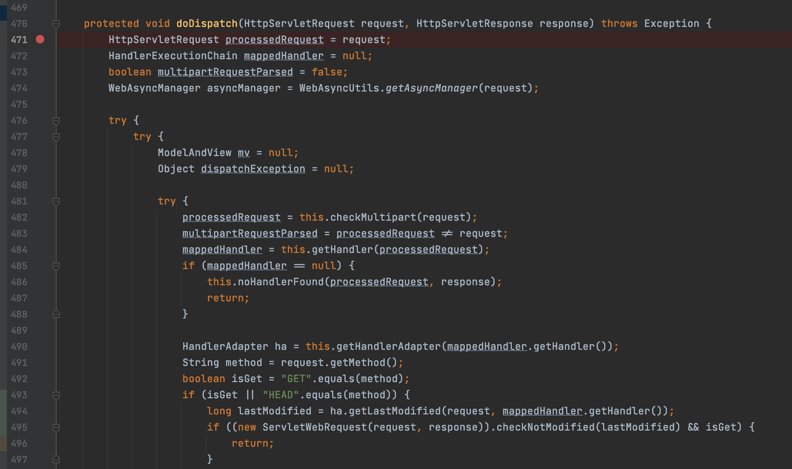
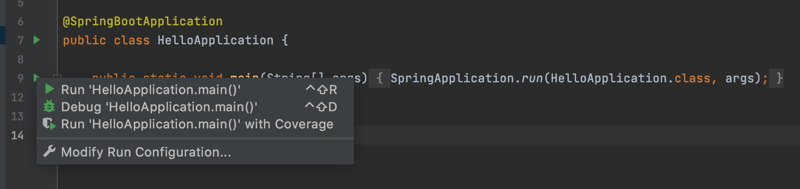
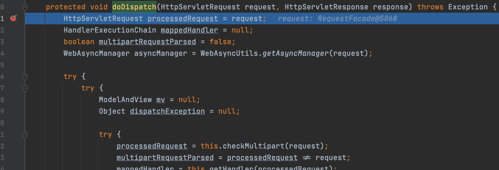
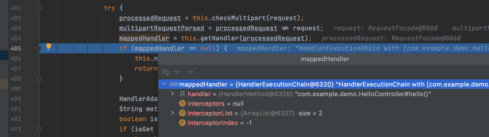
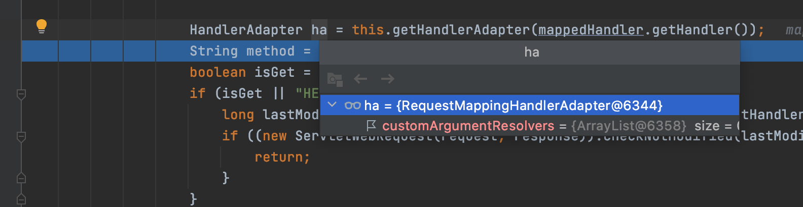
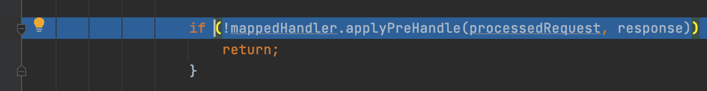
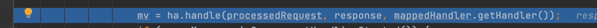
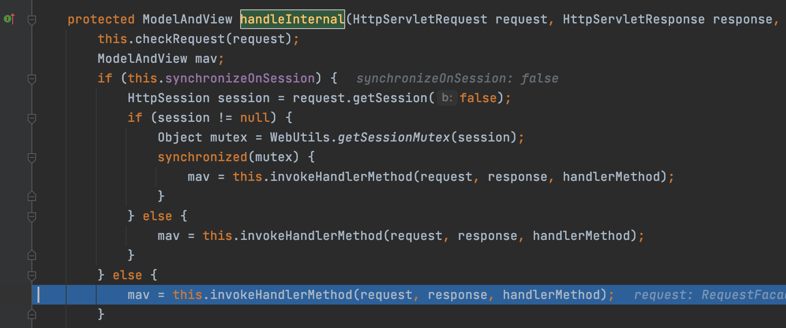
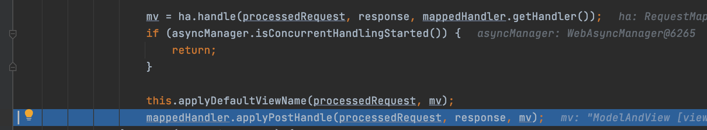
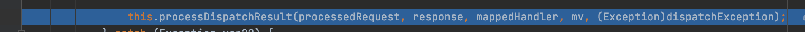

Spring Web Mvc로 웹 애플리케이션을 개발해보신 분들은 정말 짧은 코드로 웹 요청이 처리돼서 신기하다고 생각하신 분들이 많을 것 같습니다. 특히 Spring Boot를 사용하면 너무 쉽게 웹 요청을 처리 할 수 있습니다.

어떻게 이렇게 쉽게 웹 요청을 처리할 수 있는지 알아보도록 하겠습니다.

Spring Web MVC는 Servlet 기술을 기반으로 만들어졌고 Servlet을 이용해서 웹 요청을 처리하고 응답합니다. Spring Web MVC에서는 웹 요청을 DispatcherServlet이 전담해서 처리합니다. 따라서 Spring Web MVC의 요청 처리를 분석하는 것은 결국 DispathcherServlet을 분석하는 것입니다.

## DispatcherServlet이란?

DispathcerServlet이 무엇인지 이해하려면 Servlet과 Front Controller 패턴이 무엇인지 알고있어야 합니다. 두 개념에 대해 간단히 알아보도록 하겠습니다.

### Servlet이란?

Servlet은 http 요청을 동적으로 처리하기 위한 Java EE의 스펙입니다.

요청을 동적으로 처리하는 코드를 Servlet 클래스를 스펙에 맞게 구현하고 Servlet 컨테이너에 등록하면 요청이 들어올 때 요청 Path에 해당하는 Servlet 클래스를 실행시켜줍니다.

Servlet을 활용하면 클라이언트의 요청에 따라 다양한 동작을 수행하는 코드를 작성할 수 있습니다. 그런데 Servlet을 여러개 만들어서 개발을 하다보면 보안, 로깅 등의 공통적인 동작을 하는 코드의 중복이 생길 때 가 많습니다.

이런 중복을 줄이기 위해 Front Controller라는 패턴이 나왔습니다.

### Front Controller 패턴이란?

Front Controller 패턴은 Servlet에서 공통되는 기능들을 통합하기 위한 패턴입니다.

하나의 Servlet 구현체만 Servlet Container에 등록해서 공통되는 기능들을 한번만 작성하고 Servlet 내부에서 path, header 등으로 요청 처리가 분기 되도록 구현합니다.

간단한 Front Controller 패턴의 예시입니다.

```
@WebServlet("/report")
public class MoodServlet extends HttpServlet {
  Map<String, HttpServlet> handlers;

  public void doGet(HttpServletRequest request, HttpServletResponse response) {
    String path = request.getPathInfo();

    logger.info("path: " + path);

    HttpServlet handler = handlers.get(path);
    if (path == null) {
      // 404
    }

    handler.doGet(request, response);
  }
}
```

위 예제에서는 get 요청시 공통 로깅 처리 후 handler map에서 처리 handler를 찾아서 요청 처리를 분기하는 코드입니다. 상용 웹 애플리케이션에서는 훨씬 많은 공통 기능이 들어 갈 수 있습니다.

### DispatcherServlet

Servlet과 Front Controller를 왜 먼저 알아봤는지 대충 짐작하셨을 것 같습니다. 

DispatcherServlet은 Spring Web Mvc에서 Front Controller 패턴을 구현한 Servlet입니다. 따라서 수많은 기능들을 통합해서 개발자들이 쉽게 웹 요청을 처리할 수 있도록 개발할 수 있도록 도와줍니다.

그럼 이제 DispatcherServlet 클래스의 내부를 분석해보고 어떻게 요청을 처리하는지 알아보겠습니다.

## DispatcherServlet 분석

DispathcerServlet의 모든 기능을 이 글에서 한번에 다룰 수는 없기 때문에 get 요청 예제코드를 작성해서 DispatcherServlet이 handler를 찾고 실행한 다음 결과를 처리하는 방식까지만 분석해보겠습니다. 나머지 기능들은 직접 분석해보시면 좋을 것 같습니다 :)

코드를 분석할 때 모든 코드를 눈으로 읽는 것도 좋지만 IDE의 debugging 기능을 활용하면 좀 더 쉽고 빠르게 코드를 이해할 수 있다고 생각합니다.

간단한 Controller 를 디버깅하면서 DispatcherServlet을 분석해보겠습니다.

```
DispatcherServlet 분석 환경
- Intellij CE
- Spring Boot 프로젝트(Spring Web 의존성만 추가)
```

### DispatcherServlet 디버깅

예제로 사용한 Controller 코드입니다.

```
@Controller
public class HelloController {
    @GetMapping("/hello")
    public String hello() {
        return "hello";
    }
}
```

디버깅을 실행하기 전 DispatcherServlet 클래스를 찾습니다.

*Mac에서는 Cmd + O 버튼 window에서는 Ctrl + O 버튼을 누르고 DispatcherServlet을 검색하면 찾을 수 있습니다.*


DispatchServlet에는 doGet이 없기때문에 부모 추상 클래스인 FrameworkServlet 클래스를 찾으면 doGet을 찾을 수 있습니다.

요청은 다음과 같은 순서로 처리됩니다.

1. doGet 메소드 (in FrameworkServlet.class)
2. processRequest 메소드 (in FrameworkServlet.class)
3. doService 메소드 (in DispatcherServlet)
4. doDispatch 메소드 (in DispatcherServlet)
5. processDispatchResult (in DispatcherServlet)

핸들러를 찾아서 실행하는 부분은 DispatcherServlet의 doDispatch 메소드에 있기 때문에 doDispatch 메소드에 브레이크 포인트를 걸어줍니다.


intellij main에서 좌측 실행 버튼을 클릭하고 debug 모드로 진입합니다.


디버깅 모드가 실행되고 브라우져에서 localhost:8080/hello에 접속하면 브레이크가 걸리는 것을 확인 할 수 있습니다.


*이제 F8 버튼을 누르면서 코드를 한단계씩 실행하다보면 다음과 같은 부분이 나옵니다.*


위 단계는 다음과 같은 순서로 진행됩니다.
1. `processedRequest = this.checkMultipart(request);` - 요청이 multipart 타입인지 확인합니다.
2. `multipartRequestParsed = processedRequest != request;` - multipart 파싱 여부를 계산합니다.
3. `mappedHandler = this.getHandler(processedRequest);` - request 객체를 처리하기에 적절한 handler를 찾습니다.
4. `if (mappedHandler == null) { ... }` - 반환된 handler가 null인지 확인합니다. null이면 예외처리를 진행합니다.

mappedHanlder에 마우스를 올려보면 해당 객체가 어떤 타입인지 확인이 가능합니다. 위 이미지에서 볼 수 있듯이 등록했던 HelloController의 hello 메소드가 정상적으로 찾아지는 것을 확인 할 수 있습니다.

getHandler 메소드는 여러가지 복잡한 단계를 거쳐 handler를 찾으므로 이 글에서는 분석을 제외하겠습니다. 시간이 있으실 때 직접 분석해보시면 좋을 것 같습니다:)
더 많은 단계가 있지만 쉽게 생각해서 request의 path와 method를 처리할 수 있는 handler 객체를 찾는다고 생각하시면 좋을 것 같습니다. 훨씬 단순하긴 하지만 위에서 설명했던 Front Controller 패턴의 map에서 Servlet 객체를 찾는 과정과 동일한 부분입니다.

*이제 또 다음단계로 진행하기 위해 F8 버튼을 클릭해주면 다음과 같은 부분이 나옵니다.*


```
HandlerAdapter ha = this.getHandlerAdapter(mappedHandler.getHandler());
```

이 부분은 handler를 실행시켜 줄 수 있는 HandlerAdapter를 찾는 코드입니다. handler는 어떤 요청인지에 따라 타입이 결정되는 추상화된 메소드기 때문에 Object 타입으로 지정되어있고 컴파일타임에 타입을 지정할 수 없습니다. 따라서 해당 handler를 실행해주려면 타입 변환을 해야 하는데 그 역할을 하는 객체가 HandlerAdapter입니다.

위 코드에서는 RequestMappingHandlerAdapter라는 HandlerAdapter가 반환됐는데 HandleMethod 타입의 handler를 실행 시켜줄 수 있습니다. @RequestMapping이 붙은 메소드는 스프링 컨테이너 시작시에 HandlerMethod 형태로 변환됩니다. 따라서 대부분 웹 개발시에 RequestMappingHandlerAdapter 선택된다고 생각하시면 될 것 같습니다.

위 부분은 조금 복잡한 과정이라서 이해가 쉽게 안된다면 일단 요청에 대한 handler를 실행시켜주는 객체를 찾는다고 생각하고 넘어가주시기 바랍니다.

*다시 F8 버튼을 눌러서 다음 단계로 진행하겠습니다. isGet을 체크하는 부분은 웹 캐싱과 관련된 부분으로 생략하겠습니다.*


위 부분은 handler 메소드 실행 전에 interceptor가 실행되는 부분입니다. 웹 개발할 때 interceptor에 뭔가 문제가 있다면 해당 부분을 디버깅 해보는 것도 큰 도움이 될 것 같습니다.

*F8을 눌러서 또 진행하도록 하겠습니다* 드디어 handler 메소드가 실행되는 부분입니다.


handler 메소드는 가장 핵심이 되는 부분으로 F7을 누르면서 메소드 실행 내용을 한 단계씩 보도록 하겠습니다. F7 버튼을 몇번 누르다 보면 RequestMappingHandlerAdapter라는 클래스의 handleInternal이라는 메소드에 진입하게 됩니다.

가장 중요한 부분은 this.invokeHandlerMethod를 호출하는 부분입니다.


invokeHandlerMethod 내부를 보면 HandlerMethod를 호출 가능하도록 ServletInvocableHandlerMethod 객체로 변환을 하고 여러가지 과정을 거칩니다.

많은 과정이 있지만 몇가지만 살펴보겠습니다.

파라미터를 메소드의 인수로 변환할 수 있는 resolver 목록을 설정합니다.
```
invocableMethod.setHandlerMethodArgumentResolvers(this.argumentResolvers);
```

handler의 결과값을 처리하는 처리기를 설정합니다. 이 returnValueHandlers를 이용해서 해당 메소드가 반환한 값이 view 형태인지 json 형태인지(messageConverter) 등을 판별해서 처리 할 수 있습니다.

```
invocableMethod.setHandlerMethodReturnValueHandlers(this.returnValueHandlers);
```

파라미터를 객체로 변환해주는 DataBinder 팩토리 설정입니다.
```
invocableMethod.setDataBinderFactory(binderFactory);
```

이 밖에도 handler를 실행하기 위해 많은 기능을 설정합니다.

마지막으로 handler가 실행되고 mavContainer에 ModelAndView가 세팅됩니다.
```
invocableMethod.invokeAndHandle(webRequest, mavContainer, new Object[0]);
```

*다시 F8을 눌러 RequestMappingHandlerAdapter의 실행을 마치고 DispatcherServlet 코드 실행으로 돌아갑니다*



단계별로 설명드리겠습니다.
1. `mv = ha.handle(processedRequest, response, mappedHandler.getHandler());` - 실행 된 handler의 결과인 ModelAndView가 반환됩니다.
2. `this.applyDefaultViewName(processedRequest, mv);` - 만약 mv가 뷰를 가지고 있지 않다면 기본 뷰 이름을 세팅합니다(기본적으로 url을 뷰 네임으로 설정합니다).
3. `mappedHandler.applyPostHandle(processedRequest, response, mv);` - handle 실행 이후의 인터셉터가 실행됩니다.

마지막으로 렌더링처리를 하고 클라이언트에게 응답을 합니다.


## 마무리

Spring Web Mvc는 어떻게 동작할까에 대한 궁금증을 해결하고 싶어서 DispatcherServlet을 분석하게 됐는데 생각보다 쉽지 않은 과정이었습니다. 완벽하게 이해하지는 못했지만 디버깅을 통해서 큰 그림을 볼 수 있게 돼서 좋았습니다.

스프링을 사용해서 개발하는데 반드시 알아야 하는 지식들은 아니지만 코드 분석을 하면서 좋은 코드에 대해 많이 배울 수 있었습니다. 특히 추상화 된 구조로 Handler를 실행하는 부분은 정말 인상깊었습니다.

**글을 보면서 틀린 부분이 있으면 댓글로 남겨주시면 정말 감사하겠습니다.**

## 참고

* [Front Controller Pattern - Martin Fowler](https://martinfowler.com/eaaCatalog/frontController.html)
* [Oracle Servlet](https://google.com)
* [Spring Web Mvc DispatcherServlet](https://docs.spring.io/spring-framework/docs/current/reference/html/web.html#mvc-servlet)
* [Spring Web Mvc HandlerAdapter](https://docs.spring.io/spring-framework/docs/current/javadoc-api/org/springframework/web/servlet/HandlerAdapter.html)